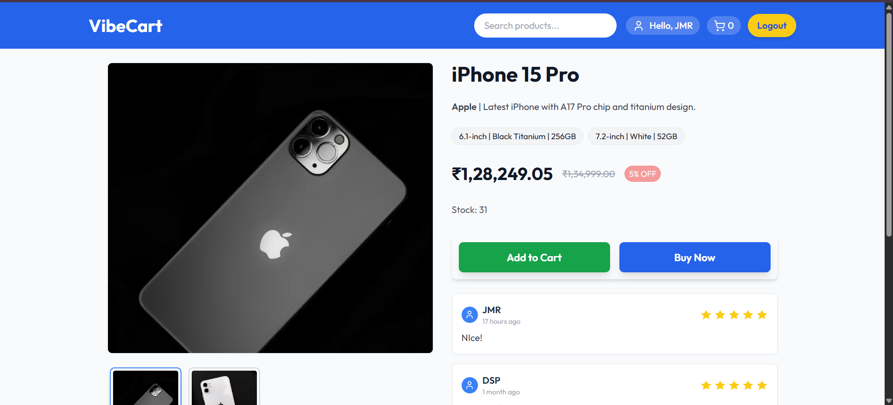
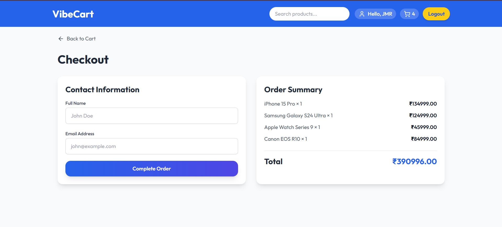
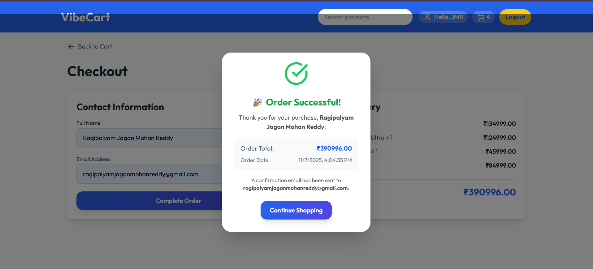
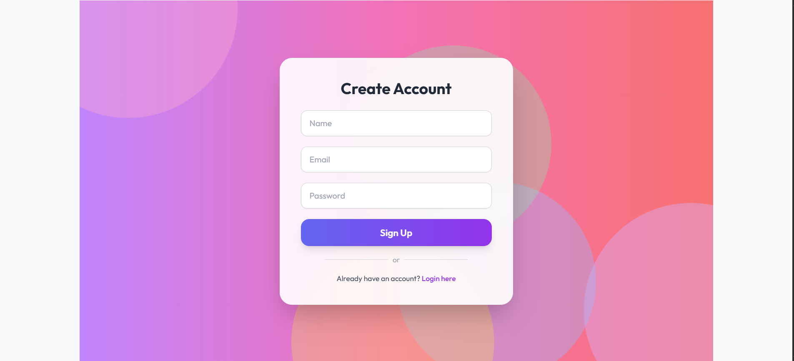

# E-Commerce Products Page 🛒

A **clean and interactive product page** for an e-commerce platform, showcasing product details, images, pricing, variants, and purchase options. Inspired by platforms like Amazon and Flipkart.

---

## 🚀 Key Features

- **Product Details Section**: Name, brand, price, availability, and specifications.  
- **Image Gallery**: Main product image with clickable thumbnails.  
- **Variants/Options**: Select size, color, or other product variants.  
- **Add to Cart / Buy Now**: Buttons for quick purchase or cart addition.  
- **Product Description**: Detailed feature list and benefits.  
- **Customer Reviews**: Ratings and user reviews for informed decisions.

---

## 💻 Technologies Used

- **Frontend**: HTML, CSS, JavaScript, React
- **Styling**: Tailwind CSS / CSS  
- **Backend**: Node.js, Express.js
- **Database**: MongoDB

 ## ⚡ Installation & Setup

1. Clone the repository:

```bash
git clone https://github.com/JaganReddy-33/VibeCart_web
-> Navigate to folder
cd VibeCart_web
-> intall dependencies
npm install
-> Run Project
npm run start or npm start


## 🎬 Demo Video

[](https://drive.google.com/file/d/1IQCUfr1xIe1ZEgPsqm_ptOjw4w4kQxqo/view?usp=sharing)

---

## 📸 Screenshots

### 🏠 Home Page


### 🛍️ Product Page


### 🛒 Cart Page


### 💳 Checkout Page


### ✅ Order Confirmation Page


### 👤 Register Page



